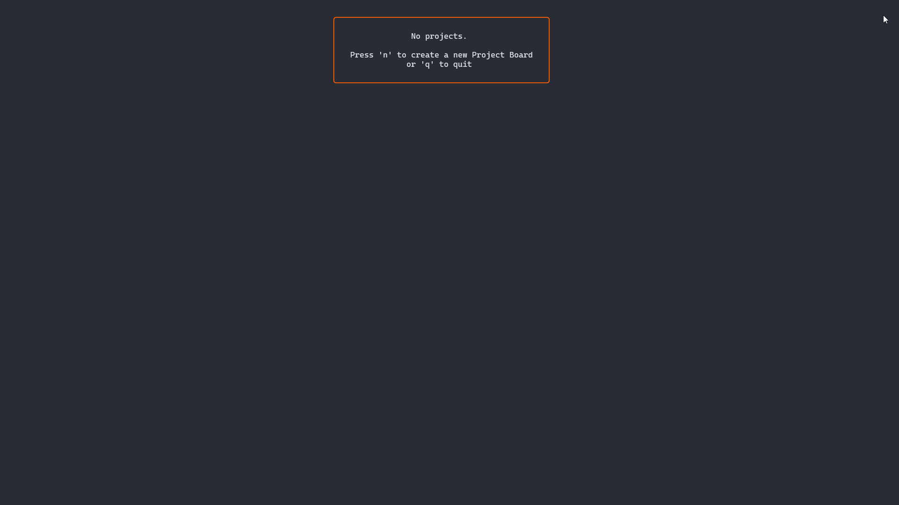

# Kanboards - a Kanban CLI app  
  

Kanboards is a Trello clone for the CLI designed to be customizable and portable:  
- manage multiple projects
- add/remove boards and move them around
- tasks have checklists to further divide work
- label tasks for categorization    
- import/export to YAML for portability   

### Install:  
1. install [go](https://go.dev/doc/install)
2.  Clone the repo and get the dependencies:  
  - [bubbletea](https://github.com/charmbracelet/bubbletea)
  - [lipgloss](https://github.com/charmbracelet/lipgloss)  
  - [bubbles](https://github.com/charmbracelet/bubbles)
  - [ds](https://github.com/Anacardo89/ds)  
3.  `go run .`

### Usage:  
Commands are written on screen, apart from that:  
- the first time you run kanboards a directory with the same name will be created in your home directory  
- import/export from/to YAML with `i` and `e` when at main screen  
- YAML file is placed in the kanboards directory  
- you can only import into an empty DB, if there are already projects loaded `i` will do nothing  

You can just copy the `.db` file instead of the `.yaml` one and it will be just as portable, as long as the files are placed in `HOME/kanboards/` but i wanted to do something with YAML so there you go. :)
